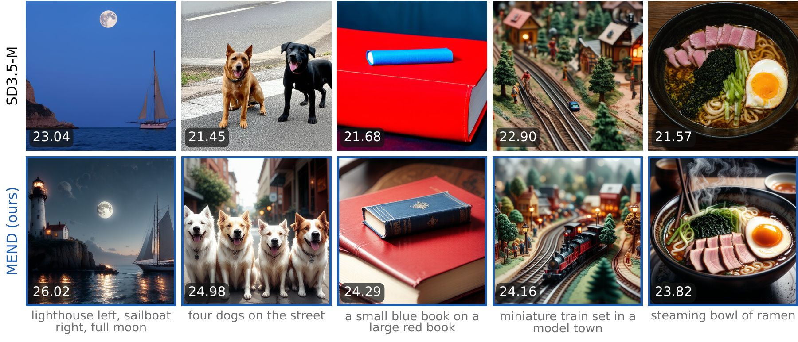

# MEND: RL for Flow Models via Proximal Velocity Matching

[](https://arxiv.org/abs/2610.05954)
[](https://shreshthsaini.github.io/MEND-RL/)
[](https://github.com/shreshthsaini/MEND-RL)
[](https://shreshthsaini.github.io/MEND-RL/blog.html)
[](https://huggingface.co/collections/shreshthsaini/mend-rl-for-flow-models-via-proximal-velocity-matching-6ac5d201a2821178270f97ce)
[](https://huggingface.co/papers/2610.05954)

[](https://github.com/shreshthsaini/MEND-RL/actions/workflows/tests.yml)
[](LICENSE)

Shreshth Saini<sup>1,2</sup>, Neil Birkbeck<sup>2</sup>, Yilin Wang<sup>2</sup>, Balu Adsumilli<sup>2</sup>, Alan C. Bovik<sup>1,3</sup>

<sup>1</sup>The University of Texas at Austin, <sup>2</sup>Google, <sup>3</sup>University of Colorado Boulder

[arXiv:2610.05954](https://arxiv.org/abs/2610.05954), 2026.

MEND is a reinforcement learning method for reward post-training of flow-matching image models, built on proximal velocity matching. Within each prompt group it caps rewards at a quantile, so samples that already score well receive no move. Below the cap it proposes moves along the reward gradient and accepts one only when its capped reward gain exceeds a quadratic displacement price. The model then regresses onto the resulting velocity targets. There is no KL term, no frozen reference model in the loss, and no advantage weighting. This repository contains the training code for Stable Diffusion 3.5 Medium and Z-Image-Turbo, the evaluation suite, the baseline trainers used for comparison, and CPU tests.



SD3.5-M (top) and MEND after 100 updates (bottom), same prompt and initial noise. The number on each tile is its PickScore.

## Released weights

The official [Hugging Face collection](https://huggingface.co/collections/shreshthsaini/mend-rl-for-flow-models-via-proximal-velocity-matching-6ac5d201a2821178270f97ce) groups the adapters, [paper](https://huggingface.co/papers/2610.05954), and [project Space](https://huggingface.co/spaces/shreshthsaini/MEND-RL). Each model includes the original PEFT adapter, an equivalent Diffusers LoRA, checksums, sampling settings and citation.

| Adapter | Download | Updates | Guidance |
| --- | --- | ---: | ---: |
| `mend_pickscore` | [MEND-SD3.5M-PickScore](https://huggingface.co/shreshthsaini/MEND-SD3.5M-PickScore) | 100 | 4.5 |
| `mend_open3` | [MEND-SD3.5M-ThreeReward](https://huggingface.co/shreshthsaini/MEND-SD3.5M-ThreeReward) | 300 | 1.0 |

Both use SD3.5 Medium at 512 pixels and 40 steps. `mend_open3` trains on PickScore, HPSv2.1 and CLIPScore. The aliases pin a Hub commit and check the original adapter's SHA256 hashes. The adapters are public; downloading the base model requires accepting its terms. Start generating with the commands below or use `pipe.load_lora_weights(...)` as shown in [INFERENCE.md](guides/INFERENCE.md#diffusers).

## Results

Main comparison on DrawBench, 200 prompts x 5 seeds, 512 px, 40 Euler steps (Table 1 of the paper). "Dist. to base" is the DreamSim distance to the base model's image for the same prompt, noise and sampling settings; lower is closer.

| Method | Rewards | Updates | PickScore | HPSv2.1 | HPSv3 | ImageReward | CLIPScore | Aesthetic | Dist. to base |
| --- | --- | ---: | ---: | ---: | ---: | ---: | ---: | ---: | ---: |
| SD3.5-M | none | 0 | 22.35 | 0.280 | 2.72 | 0.83 | 0.283 | 5.39 | 0 |
| Flow-GRPO | PickScore | ~4k | 23.52 | 0.316 | 7.04 | 1.27 | 0.280 | 5.90 | 0.313 |
| DiffusionNFT | five | 1.7k | 23.82 | 0.331 | 7.50 | 1.49 | 0.292 | 6.02 | 0.538 |
| **MEND** | PickScore | 100 | 23.70 | 0.319 | 7.15 | 1.32 | 0.291 | 5.88 | 0.313 |
| **MEND** | three | 300 | 23.89 | 0.344 | 5.87 | 1.28 | 0.300 | 5.92 | 0.488 |

- In 100 updates, MEND outperforms the Flow-GRPO PickScore adapter (about 4k updates) on five of six evaluators at the same base distance. Flow-GRPO is higher on aesthetic score.
- The three-reward run (PickScore, HPSv2.1, CLIPScore; 300 updates) surpasses the five-reward DiffusionNFT model on those three evaluators and is lower on the other three.
- Under the equal-budget protocol (48 prompts x 24 images per update, 100 updates), MEND surpasses ReFL and DiffusionNFT on each of four training rewards. For PickScore it reaches 24.03, against 23.92 for ReFL and 23.43 for DiffusionNFT.
- MEND also improves SD3-M and the distilled Z-Image-Turbo at the same update budget.
- The 100-update SD3.5-M run costs 10.0 GPU-hours on three GB200 GPUs, excluding evaluation.

The rows use each model's own sampling setting: guidance 4.5 for SD3.5-M, Flow-GRPO and the PickScore MEND row, guidance 1 for DiffusionNFT and the three-reward MEND row. Flow-GRPO and DiffusionNFT rows are the authors' released adapters, evaluated in this repository's pipeline. Each MEND configuration has one training seed. The remaining tables and their protocols are in [guides/REPRODUCING.md](guides/REPRODUCING.md).

## What is included

Included:

- MEND trainers for SD3.5-M and Z-Image-Turbo, with the ablation switches as config flags (`mend/`, `configs/mend.py`).
- The evaluation suite: six reward evaluators, base distance, diversity, and paired bootstrap tables (`mend/eval/`).
- Baseline trainers for DiffusionOPSD, Flow-GRPO, DiffusionNFT and ReFL (`baselines/`).
- Prompt lists and the recipe that rebuilds the Pick-a-Pic training prompts (`data/`).
- CPU tests of the algorithm, trainers on tiny fake models, and the evaluation tools (`tests/`).
- Official SD3.5-M PickScore and three-reward evaluation adapters on Hugging Face, in PEFT and Diffusers formats.

Not included:

- Datasets, base model weights and reward model weights. Scripts download the public ones; the base models may require accepting their terms on Hugging Face.
- A packaged preset for the SD3-M runs in the paper. See [guides/TRAINING.md](guides/TRAINING.md#other-backbones).

Training was not rerun from this packaged tree, and bitwise equality with the paper's runs is not claimed.

## Installation

Training and evaluation need Linux and CUDA GPUs. The CPU tests run anywhere. The validated stack is Python 3.11, PyTorch 2.6 or newer, and Transformers 4.51.

```bash
git clone https://github.com/shreshthsaini/MEND-RL.git
cd MEND-RL
uv venv --python 3.11 .venv
source .venv/bin/activate
uv pip install torch torchvision --index-url https://download.pytorch.org/whl/cu128   # pick the build for your CUDA
uv pip install -e ".[rewards,dev]"
```

Reward weights and training prompts:

```bash
export REWARD_CKPT_PATH="$PWD/reward_ckpts"
bash scripts/download_reward_weights.sh
python -m mend.data.prepare_pickapic
python -m mend.rewards.check_setup --backbone sd35 --reward pickscore
```

[guides/INSTALL.md](guides/INSTALL.md) covers ImageReward, HPSv3, DreamSim, Z-Image-Turbo and the environment variables.

## Quick start

For generation, install the core package with `uv pip install -e .`; reward models and training data are unnecessary. Accept the [SD3.5 Medium terms](https://huggingface.co/stabilityai/stable-diffusion-3.5-medium) and run `hf auth login` before its first download.

Generate immediately with the released PickScore adapter:

```bash
python scripts/generate.py --lora mend_pickscore \
  --prompt "a small blue book on a large red book" --seeds 0 \
  --guidance_scale 4.5 --num_steps 40 --resolution 512 --batch_size 1 \
  --out_dir outputs/samples/mend_pickscore
```

For the three-reward model, use `--lora mend_open3 --guidance_scale 1.0` and a separate output directory. Generation automatically downloads the adapter and base pipeline. `python scripts/download_weights.py --list` lists the pinned releases; `python scripts/download_weights.py mend_pickscore` downloads and validates the adapter without loading a model. Local PEFT adapters and `namespace/repo[/subfolder]` also work. See the [inference guide](guides/INFERENCE.md) for Diffusers, offline use and revision pinning.

Check the target-selection math on CPU, with no model download:

```bash
python -m pytest -q tests/test_mend_cpu.py tests/test_mend_ablation_cpu.py
```

Train the PickScore recipe of the paper on SD3.5-M (three GPUs, 100 updates, 48 prompts x 24 images per update):

```bash
NPROC=3 UPDATES=100 OUTPUT_DIR=outputs/mend_pickscore \
bash scripts/train_mend.sh pickscore \
  --config.mend.proposal=explicit \
  --config.mend.target_mode=single_state_x0 \
  '--config.mend.etas_explicit=(0.1,0.2,0.4)' \
  --config.mend.q=0.75 \
  --config.mend.lambda_keep=10 \
  --config.mend.d_fixed_rms=0.0 \
  --config.train.adam_epsilon=1e-12
```

Generate images with the trained adapter:

```bash
python scripts/generate.py \
  --lora outputs/mend_pickscore/checkpoints/checkpoint-100/lora \
  --prompt "a small blue book on a large red book" \
  --seeds 0,1,2,3 --guidance_scale 4.5 --out_dir outputs/samples/mend_pickscore
```

Evaluate it on DrawBench:

```bash
python -m mend.eval.suite all --run mend_pickscore_F \
  --lora outputs/mend_pickscore/checkpoints/checkpoint-100/lora \
  --protocol flowgrpo --train_reward pickscore \
  --metrics pickscore,hpsv2,hpsv3,imagereward,clipscore,aesthetic,diversity \
  --out outputs/eval/mend_pickscore_F.json
```

## Documentation

| Guide | Contents |
| --- | --- |
| [guides/INSTALL.md](guides/INSTALL.md) | Environment, reward models, data, environment variables |
| [guides/TRAINING.md](guides/TRAINING.md) | Method summary, the paper recipe, other rewards and backbones, resuming, ablation switches, baselines |
| [guides/INFERENCE.md](guides/INFERENCE.md) | Generating images with a trained adapter |
| [guides/EVALUATION.md](guides/EVALUATION.md) | The six evaluators, base distance, diversity, paired tables |
| [guides/REPRODUCING.md](guides/REPRODUCING.md) | Paper tables, the commands behind each row, and what is reported from other papers |
| [guides/TESTING.md](guides/TESTING.md) | CPU tests, shell tests, continuous integration |
| [guides/INFRA.md](guides/INFRA.md) | Optional Slurm task spool used for the paper runs |

## Repository layout

```
mend/
  algorithm/    cap, proposals, proximal verdict, price controller, regression targets, diagnostics
  train/        MEND trainers for SD3.5-M (sd3.py) and Z-Image-Turbo (zimage.py), config dry run
  sampling/     rollout pipelines and ODE solvers
  rewards/      reward models, the scoring registry, differentiable Z-Image reward bridges
  eval/         evaluation suite, image metrics, VLM judge, bootstrap tables
  analysis/     base distance, diversity and collapse statistics, theory probes, figure builders
  tracking/     Weights & Biases logging helpers
  data/         prompt preparation
  utils/        EMA, checkpoint and resume, metric logging, profiling
baselines/      DiffusionOPSD, Flow-GRPO, DiffusionNFT and ReFL trainers and launchers
configs/        ml_collections presets (mend.py and the shared protocol presets), best_mend.env
scripts/        launchers and entry points: train_mend.sh, generate.py, evaluate.py
infra/          optional Slurm fleet jobs and a resumable task spool
data/           prompt recipes and evaluation prompt lists
tests/          CPU tests and shell tests
guides/         documentation
docs/           project page (GitHub Pages)
```

## Citation

If you use MEND, please cite the [arXiv paper](https://arxiv.org/abs/2610.05954).

```bibtex
@misc{saini2026mend,
  title         = {{MEND}: {RL} For Flow Models via Proximal Velocity Matching},
  author        = {Saini, Shreshth and Birkbeck, Neil and Wang, Yilin and Adsumilli, Balu and Bovik, Alan C.},
  year          = {2026},
  eprint        = {2610.05954},
  archivePrefix = {arXiv},
  primaryClass  = {cs.LG},
  doi           = {10.48550/arXiv.2610.05954},
  url           = {https://arxiv.org/abs/2610.05954}
}
```

## License

The code is released under the [Apache License 2.0](LICENSE). [NOTICE](NOTICE) lists the files derived from other projects. Released SD3.5-M adapters use the Stability AI Community License, included with each model. Powered by Stability AI. Base models, reward models and datasets keep their own terms.

## Acknowledgements

The training harness, sampling code, reward scorers and baseline trainers are adapted from [DiffusionOPSD](https://github.com/worldbench/DiffusionOPSD) (Apache-2.0). The compared methods are [Flow-GRPO](https://github.com/yifan123/flow_grpo), [DiffusionNFT](https://github.com/NVlabs/DiffusionNFT) and ReFL from [ImageReward](https://github.com/zai-org/ImageReward). We thank their authors for releasing code and checkpoints.
